# Cortex Command

An opinionated AI workflow framework for [Claude Code](https://docs.anthropic.com/en/docs/claude-code). It coordinates how development work flows from a vague idea through research, specification, planning, implementation, and review -- across single features, parallel batches, or fully autonomous overnight sessions. Skills are the primitive units; hooks wire them into the development environment at the right moments; and state files let the system resume across sessions and tool invocations. All config is deployed via symlinks.

## Prerequisites

- [Claude Code](https://docs.anthropic.com/en/docs/claude-code) CLI
- [just](https://just.systems/) command runner (`brew install just`)
- Python 3.12+
- [uv](https://docs.astral.sh/uv/) package manager (`brew install uv`)

## Quick Start

```bash
git clone https://github.com/charleshall888/cortex-command.git ~/cortex-command
cd ~/cortex-command
just setup
```

> **Important:** Add the following to your shell profile (`.zshrc`, `.bashrc`, etc.):
>
> ```bash
> export CORTEX_COMMAND_ROOT="$HOME/cortex-command"
> ```
>
> Several components (the `jcc` wrapper, overnight runner) require this variable.
> If you clone to a different location, update the path accordingly and also edit
> `claude/settings.json` to update the `allowWrite` path under `sandbox.filesystem`.

### Backup Warning

`just setup` creates symlinks that **replace** existing files in `~/.claude/`. If you already have Claude Code configured, back up these files first:

- `~/.claude/settings.json`
- `~/.claude/CLAUDE.md`
- `~/.claude/statusline.sh`
- Any custom skills in `~/.claude/skills/`
- Any custom hooks in `~/.claude/hooks/`

The setup recipe will warn before overwriting non-symlink files at these locations.

## What's Inside

| Component | Description |
|-----------|-------------|
| `skills/` | Slash commands -- `/commit`, `/pr`, `/lifecycle`, `/overnight`, `/discovery`, and more |
| `hooks/` | Event handlers -- commit validation, lifecycle state injection, desktop notifications |
| `claude/overnight/` | Autonomous overnight runner -- plans work, executes in parallel, writes a morning report |
| `claude/dashboard/` | FastAPI web dashboard for monitoring overnight sessions |
| `lifecycle/` | Feature state machine -- research, specify, plan, implement, review, complete |
| `backlog/` | YAML-frontmatter backlog items with overnight readiness gates |
| `claude/reference/` | Reference docs loaded conditionally by agent instructions |
| `bin/` | CLI utilities deployed to `~/.local/bin/` -- `jcc` (recipe wrapper), `count-tokens`, `audit-doc`, `overnight-start` |

## Workflow Diagrams

### Diagram A — Main Workflow Flow

```mermaid
graph TD
    START([New idea / request])
    DEV["/dev · routing hub"]

    LC["/lifecycle\nfull interactive · single feature\nClarify → Research → Specify → Plan → Implement → Review → Complete"]
    DISC["/discovery\nresearch + decompose\ncreates backlog tickets"]
    BACKLOG[("Backlog")]

    REFINE["/refine\nClarify → Research → Specify\nsets status: refined"]
    GATE{"Readiness\ngate\nresearch ✓  spec ✓"}

    OVN["/overnight\nselect · plan · execute\nparallel workers per feature"]
    INTBR["overnight/&#123;session&#125; branch"]

    MR["/morning-review\nanswer deferrals\nadvance lifecycles\nmerge PR → main"]

    EVOLVE["/retro → /evolve\nself-improvement loop"]

    MAIN([main branch])

    START --> DEV
    DEV -->|"single feature"| LC
    DEV -->|"vague / research"| DISC
    DEV -->|"batch / what's next"| BACKLOG

    DISC -->|"creates tickets"| BACKLOG

    BACKLOG -->|"pick item"| REFINE
    REFINE -->|"status: refined + artifacts"| GATE
    GATE -->|"eligible"| OVN
    GATE -->|"needs more prep"| REFINE

    OVN --> INTBR
    INTBR --> MR
    MR -->|"PR merged"| MAIN
    MR -->|"closes tickets"| BACKLOG

    LC -->|"Complete · closes ticket"| MAIN

    MAIN --> EVOLVE
    EVOLVE -->|"new items"| BACKLOG
```



### Diagram B — Lifecycle Phase Sequence

```
[Discovery artifacts] -----------------------------+
                                                   |  (skips Clarify + Research + Specify)
                                                   v
+---------+    +----------+    +---------+    +--------+    +-----------+    +--------+    +----------+
| Clarify +--> | Research +--> | Specify +--> |  Plan  +--> | Implement +--> | Review +--> | Complete |
+---------+    +----------+    +---------+    +--------+    +-----------+    +--------+    +----------+
[________________ /refine _______________]
                                                                  |              |
                                                                  |  [rework]    |
                                                                  ^--------------+

Review phase conditions:
  - Skipped for simple tier (1-5 files, existing pattern, clear requirements)
  - Required for complex tier (6+ files, novel pattern, ambiguous scope)
  - Always forced for high and critical criticality
```

## Customization

`claude/settings.json` is tracked and symlinked to `~/.claude/settings.json`. Review and adjust the model, session retention, thinking mode, and experimental flags for your own setup. Use `settings.local.json` in any project for per-machine overrides without modifying the tracked file.

## Commands

Run `just` to see all recipes (30+). Key commands:

```
just setup                 # Full install (symlinks + Python deps)
just check-symlinks        # Verify all symlinks are intact
just test                  # Run all test suites
just overnight-run         # Run overnight in foreground
just overnight-start       # Run overnight in detached tmux
just overnight-status      # Live status display
just dashboard             # Start the web dashboard
just validate-commit       # Test commit message hook
just validate-skills       # Check skill frontmatter
```

## Documentation

| Guide | Covers |
|-------|--------|
| [`docs/agentic-layer.md`](docs/agentic-layer.md) | Full skill and hook inventory, workflow diagrams, lifecycle phase map |
| [`docs/setup.md`](docs/setup.md) | Installation, symlinks, macOS caffeinate, GPG/PAT config |
| [`docs/overnight.md`](docs/overnight.md) | Autonomous overnight runner -- planning, execution, deferral, morning review |
| [`docs/dashboard.md`](docs/dashboard.md) | Web dashboard for monitoring overnight sessions |
| [`docs/backlog.md`](docs/backlog.md) | Backlog YAML schema, readiness gates, overnight eligibility |
| [`docs/interactive-phases.md`](docs/interactive-phases.md) | What to expect at each lifecycle phase -- questions, artifacts, flow |
| [`docs/pipeline.md`](docs/pipeline.md) | Internal pipeline orchestration module reference |
| [`docs/skills-reference.md`](docs/skills-reference.md) | Per-skill detailed reference |

## License

[MIT](LICENSE)
