[← Back to README](../README.md)

# Agentic Layer

**For:** Existing users, contributors, or anyone building on or tuning this skill system.  **Assumes:** Basic familiarity with the repo and Claude Code.

The agentic layer is the workflow orchestration system built on top of Claude Code skills. It coordinates how development work flows from a vague idea through research, specification, planning, implementation, and review — across single features, parallel batches, or fully autonomous overnight sessions. Skills are the primitive units; hooks wire them into the development environment at the right moments; and state files let the system resume across sessions and tool invocations.

This document is a reference for the full skill inventory, the main workflow diagrams, and the lifecycle phase map. It covers all 29 skills organized by functional group, both ASCII diagrams showing how they connect, and the tier/criticality model that governs model selection and review requirements. Start with the diagrams for an orientation, then consult the skill table for individual trigger and output details.

---

## Skills

Skill count current as of this writing. `skills/` is the authoritative source — run `ls skills/` for the live list.

### Development Workflow

| Skill | Purpose | Triggers | Produces | Agent support |
|-------|---------|----------|----------|---------------|
| **dev** | Routing hub for all development requests | `/dev`, "what should I work on", "next task" | Routes based on request classification: vague/uncertain → `/discovery`; single concrete feature → `/lifecycle`; multi-feature or batch → `/pipeline`; trivial single-file change → direct implementation; no request → backlog triage | All agents |
| **lifecycle** | Structured feature development lifecycle | `/lifecycle <feature>` | `lifecycle/{feature}/*.md` + `events.log` | Claude only |
| **refine** | Prepare a backlog item for overnight (Clarify → Research → Spec) | `/refine <item>` | `lifecycle/{slug}/research.md`, `lifecycle/{slug}/spec.md`, backlog `status: refined` | Claude only |
| **overnight** | Autonomous overnight session planning | `/overnight`, `/overnight resume` | `overnight-plan.md`, `overnight-state.json` | Claude only |
| **morning-review** | Walk overnight report, close lifecycles | `/morning-review` | events.log updates, backlog closures | Claude only |
| **discovery** | Deep research → backlog decomposition | `/discovery <topic>` | `lifecycle-research/{topic}/*.md` + backlog tickets | All agents |
| **backlog** | Manage file-based backlog items | `/backlog add/list/pick/archive` | `backlog/NNN-slug.md` YAML frontmatter files | All agents |
| **research** | Parallel research orchestrator; dispatches 3–5 agents across independent angles and synthesizes findings | `/research topic="..." [lifecycle-slug=...]` | `lifecycle/{slug}/research.md` or conversation output | Claude only |

### Code Quality

| Skill | Purpose | Triggers | Produces | Agent support |
|-------|---------|----------|----------|---------------|
| **commit** | Create well-formatted git commits | `/commit`, "commit these changes" | Git commit (signed) | All agents |
| **pr** | Create GitHub pull requests | `/pr`, "create a pr" | GitHub PR via `gh pr create` | All agents |
| **pr-review** | Multi-agent PR review pipeline | `/pr-review`, `/pr-review <num>` | Structured verdict (APPROVE/REQUEST_CHANGES/REJECT) | Claude only |

### Thinking Tools

| Skill | Purpose | Triggers | Produces | Agent support |
|-------|---------|----------|----------|---------------|
| **critical-review** | Adversarial review from fresh agent | "pressure test this", "adversarial review" | Fresh agent critique (conversational) | Claude only |
| **devils-advocate** | Stress-test a direction with counterargument | "challenge this", "play devil's advocate" | Coherent argument (conversational) | All agents |
| **requirements** | Gather project/area-level requirements | `/requirements`, `/requirements <area>` | `requirements/project.md`, `requirements/{area}.md` | All agents |

### Session Management

| Skill | Purpose | Triggers | Produces | Agent support |
|-------|---------|----------|----------|---------------|
| **fresh** | Capture session state as resume prompt | `/fresh`, "context is full" | Resume prompt (user copies/pastes) | All agents |
| **retro** | Write session problem log | `/retro`, `/retro <tag>` | `retros/YYYY-MM-DD-HHmm(-tag)?.md` | All agents |
| **evolve** | Identify retro trends, route to improvements | `/evolve`, `/evolve N` | Routes to /discovery, /lifecycle, /backlog; `retros/.evolve-state.json` | All agents |

### UI Design Enforcement

| Skill | Purpose | Triggers | Produces | Agent support |
|-------|---------|----------|----------|---------------|
| **ui-brief** | Generate DESIGN.md + theme tokens | `/ui-brief` | `DESIGN.md` + `globals.css` @theme block | All agents |
| **ui-lint** | ESLint + Stylelint auto-fix-then-report | `/ui-lint` | `ui-check-results/lint.json` | All agents |
| **ui-a11y** | axe-core WCAG 2.1 AA audit via Playwright | `/ui-a11y` | `ui-check-results/a11y.json` | All agents |
| **ui-check** | Full UI design enforcement pipeline (3 layers) | `/ui-check` | `ui-check-results/summary.json` | All agents |
| **ui-judge** | Visual quality scorecard via Claude Vision | `/ui-judge` | `ui-check-results/judge.json` | Claude only |
| **ui-setup** | One-time UI toolchain setup checklist | `/ui-setup` | Checklist with install commands | All agents |

### Utilities

| Skill | Purpose | Triggers | Produces | Agent support |
|-------|---------|----------|----------|---------------|
| **skill-creator** | Guide for creating new skills | "create a skill", "write a skill" | `skills/<name>/SKILL.md` | All agents |
| **diagnose** | Systematic 4-phase debugging for skills, hooks, lifecycle, and overnight runner issues | `/diagnose`, "debug this", "why is this failing", "investigate this error" | Root cause analysis + fix + verification | Claude only |

> **Note on `pipeline`:** `pipeline` is not a user-facing skill and has no entry in `skills/`. It is an internal Python orchestration module (`claude/pipeline/`, `claude/overnight/`) invoked automatically by `/overnight` to manage multi-feature batch execution. Use `/overnight` to trigger pipeline behavior; do not invoke `pipeline` directly.

---

## Workflow Diagrams

### Diagram A — Main Workflow Flow

```mermaid
graph TD
    START([New idea / request])
    DEV["/dev · routing hub"]

    LC["/lifecycle\nfull interactive · single feature\nClarify → Research → Specify → Plan → Implement → Review → Complete"]
    DISC["/discovery\nresearch + decompose\ncreates backlog tickets"]
    BACKLOG[("Backlog")]

    REFINE["/refine\nClarify → Research → Specify\nsets status: refined"]
    GATE{"Readiness\ngate\nresearch ✓  spec ✓"}

    OVN["/overnight\nselect · plan · execute\nparallel workers per feature"]
    INTBR["overnight/&#123;session&#125; branch"]

    MR["/morning-review\nanswer deferrals\nadvance lifecycles\nmerge PR → main"]

    EVOLVE["/retro → /evolve\nself-improvement loop"]

    MAIN([main branch])

    START --> DEV
    DEV -->|"single feature"| LC
    DEV -->|"vague / research"| DISC
    DEV -->|"batch / what's next"| BACKLOG

    DISC -->|"creates tickets"| BACKLOG

    BACKLOG -->|"pick item"| REFINE
    REFINE -->|"status: refined + artifacts"| GATE
    GATE -->|"eligible"| OVN
    GATE -->|"needs more prep"| REFINE

    OVN --> INTBR
    INTBR --> MR
    MR -->|"PR merged"| MAIN
    MR -->|"closes tickets"| BACKLOG

    LC -->|"Complete · closes ticket"| MAIN

    MAIN --> EVOLVE
    EVOLVE -->|"new items"| BACKLOG
```



### Diagram B — Lifecycle Phase Sequence

```
[Discovery artifacts] -----------------------------+
                                                   |  (skips Clarify + Research + Specify)
                                                   v
+---------+    +----------+    +---------+    +--------+    +-----------+    +--------+    +----------+
| Clarify +--> | Research +--> | Specify +--> |  Plan  +--> | Implement +--> | Review +--> | Complete |
+---------+    +----------+    +---------+    +--------+    +-----------+    +--------+    +----------+
[________________ /refine _______________]
                                                                  |              |
                                                                  |  [rework]    |
                                                                  ^--------------+

Review phase conditions:
  - Skipped for simple tier (1-5 files, existing pattern, clear requirements)
  - Required for complex tier (6+ files, novel pattern, ambiguous scope)
  - Always forced for high and critical criticality
```

---

## Lifecycle Phase Map

| Phase | Artifact produced | Next phase | Conditions |
|-------|-------------------|------------|------------|
| Clarify | none (sets complexity + criticality) | Research | Always; skipped when fully bootstrapped from discovery |
| Research | `research.md` | Specify | Always; may be bootstrapped from discovery |
| Specify | `spec.md` | Plan | Always; may be bootstrapped from discovery |
| Plan | `plan.md` | Implement | Always; orchestrator-review required before approval |
| Implement | Source code + commits | Review or Complete | Always |
| Review | `review.md` | Complete | Complex tier only; forced for high/critical criticality |
| Complete | events.log closure | — | Always |

### Tiers

Features are classified into one of two tiers before planning begins:

- **Simple**: 1–5 files, existing pattern, clear requirements. Skips the Review phase.
- **Complex**: 6+ files, novel pattern, or ambiguous scope. Includes the Review phase.

### Criticality and Model Selection

Criticality is set per-feature and drives which models run at each phase and whether review is forced:

| Criticality | Research/Plan | Explore model | Build model | Review |
|-------------|--------------|---------------|-------------|--------|
| low | Single | Haiku | Sonnet | Tier-based |
| medium | Single | Haiku | Sonnet | Tier-based |
| high | Single | Sonnet | Opus | Forced |
| critical | Parallel, competing plans | Sonnet | Opus | Forced (Opus reviewer) |

---

## Workflow Narratives

> **See also:** [Interactive Phases Guide](interactive-phases.md) — covers what questions to expect, what each phase produces, and how artifacts flow between `/lifecycle`, `/refine`, and `/discovery`.

### 1. Structured Single-Feature

The most common path. The user asks `/dev` what to work on, or names a specific feature. `/dev` classifies the request as a single non-trivial feature and routes to `/lifecycle feature-name`. The lifecycle skill starts with a Clarify phase — focused questions about scope, complexity, and criticality — then runs research (codebase exploration plus a read of `requirements/project.md`), then moves to specify, where an interview surfaces acceptance criteria. Planning produces a task breakdown that the orchestrator reviews before approval. Implementation proceeds as a series of commits, one per task *(PreToolUse hook: `cortex-validate-commit` fires here and blocks any `git commit` whose message fails the style rules)*. If the feature is complex tier (6+ files, novel pattern) or high/critical criticality, the review phase runs a multi-agent verdict — four Sonnet reviewers in parallel, then an Opus cross-validator. On completion, `events.log` is updated, the backlog item is closed, and a PR is created.

### 2. Multiple Features via /overnight

When multiple backlog items are ready, the user runs `/refine` per feature to produce `research.md` and `spec.md` for each, then `/overnight` to plan and execute them in a batch. The overnight runner creates git worktrees (one per feature) *(WorktreeCreate hook fires here, setting up branch isolation for each worker)*, dispatches feature workers using the `claude/pipeline/` execution module, and merges results into an integration branch. `/morning-review` closes the loop — reading the overnight report, closing completed lifecycles, and surfacing any features that need follow-up.

### 3. Autonomous Overnight

In the evening, the user runs `/overnight` to plan a batch of features for unattended execution *(SessionStart hook: `cortex-scan-lifecycle` fires here, injecting `LIFECYCLE_SESSION_ID`, active feature state, and any fresh-resume prompts into context so the session begins oriented to current work)*. **Prerequisite**: selected features must already have discovery artifacts (`research:` and `spec:` fields in their backlog YAML frontmatter) — `/overnight` does not run interactive research or spec phases. The plan lists the eligible features and estimated duration; after user approval, a bash runner detaches in a tmux session and begins working. Through the night, the runner selects features from the approved batch, creates branches, and runs lead agents with a tier-based conflict-aware scheduling system to avoid resource contention. Each feature picks up at the plan phase (or implement, if already planned). In the morning, `/morning-review` walks the overnight report: it reads `morning-report.md` (a symlink to the latest session archive), closes completed lifecycles, merges approved PRs, and surfaces any features that need follow-up. For the full architecture and operational guide, see [Overnight: In Depth](overnight.md).

### 4. Discovery to Backlog

The user has a vague topic or area of uncertainty rather than a concrete feature. `/discovery topic` runs a deep research phase — exploring the codebase, reading requirements, and potentially searching external sources — then produces a structured spec and decomposes the work into discrete backlog tickets. Each ticket gets YAML frontmatter that may include `research:` and `spec:` fields pointing to the discovery artifacts. When the user later runs `/backlog pick` on one of those tickets and routes it through `/lifecycle`, the lifecycle skill detects the pre-existing artifacts and skips the research and specify phases, bootstrapping directly into planning.

### 5. Self-Improvement Loop

At the end of a session, `/retro` writes a structured problem log capturing what went wrong, what was slow, and what could be improved. Periodically — or after accumulating enough retro entries — `/evolve` reads the retro archive, clusters recurring themes, and routes each cluster to the appropriate fix path: `/discovery` for problems with unknown root causes, `/lifecycle` for understood fixes, `/backlog add` for simple improvements, and direct `MEMORY.md`/`CLAUDE.md` edits for configuration changes. Problems surface as improvements rather than accumulating as debt.

---

## Hook Inventory

Hooks in `hooks/` are shared entry points. Hooks in `claude/hooks/` are specific to Claude Code's permission and session model.

| File | Event | Purpose | Agents |
|------|-------|---------|--------|
| `hooks/cortex-validate-commit.sh` | PreToolUse | Validate commit message: imperative mood, ≤72 chars subject, no trailing period, blank line before body | Claude only |
| `hooks/cortex-scan-lifecycle.sh` | SessionStart | Inject `LIFECYCLE_SESSION_ID`, active feature state, overnight execution state, and fresh-resume prompts into context | Claude only |
| `hooks/cortex-notify.sh` | Stop, Notification | Desktop notifications via terminal-notifier when Claude needs input or completes (macOS) | Claude only |
| `hooks/cortex-notify-remote.sh` | Stop, Notification | Push notifications to Android via ntfy.sh HTTP API when Claude needs attention in a tmux session | Claude only |
| `hooks/cortex-cleanup-session.sh` | SessionEnd | Remove `.session` lock files from `lifecycle/*/` when a Claude Code session ends (skips on `/clear`) | Claude only |
| `claude/hooks/setup-github-pat.sh` | SessionStart | Read GitHub PATs from `~/.config/claude-code-secrets/` and write to `/tmp/claude/` so skills can authenticate `gh` inside the sandbox | Claude only |
| `claude/hooks/cortex-setup-gpg-sandbox-home.sh` | SessionStart | Create minimal GNUPGHOME in `$TMPDIR` so GPG signing works inside the Claude sandbox | Claude only |
| `claude/hooks/cortex-sync-permissions.py` | PreToolUse | Merge MCP allow/deny patterns from `settings.json` so permissions stay consistent | Claude only |
| `claude/hooks/cortex-permission-audit-log.sh` | Notification (permission_prompt) | Append one line per permission prompt to a session-scoped log in `$TMPDIR` for sandbox tuning diagnostics | Claude only |
| `claude/hooks/cortex-tool-failure-tracker.sh` | PostToolUse (Bash) | Track Bash tool failures by exit code; surface a warning via `additionalContext` after 3 failures for the same tool in one session | Claude only |
| `claude/hooks/cortex-output-filter.sh` | PreToolUse (Bash) | Filter test runner output to failures/summary before context entry; patterns configured in `.claude/output-filters.conf` per project | Claude only |
| `claude/hooks/cortex-skill-edit-advisor.sh` | PostToolUse (Write\|Edit) | Advise on skill editing best practices when a Write or Edit touches a file inside `skills/` | Claude only |
| `claude/hooks/cortex-worktree-create.sh` | WorktreeCreate | Create a git worktree with branch isolation for parallel overnight or feature work | Claude only |
| `claude/hooks/cortex-worktree-remove.sh` | WorktreeRemove | Clean up the worktree directory and merged branch after work completes | Claude only |
| `claude/hooks/bell.ps1` | Stop, Notification | Flash the WezTerm screen as a visual bell when Claude needs input (Windows) | Claude only |

### Hooks Architecture

#### Event Types

Claude Code fires hooks at six lifecycle points, each corresponding to a registered key in `claude/settings.json`:

| Event | When it fires | Typical use |
|-------|--------------|-------------|
| `SessionStart` | Once per session, before any tool use | Inject context, set up credentials, merge permissions |
| `SessionEnd` | When the session terminates | Clean up lock files, flush logs |
| `PreToolUse` | Before every tool invocation (filtered by `matcher`) | Block or allow tool calls, validate arguments |
| `PostToolUse` | After every tool invocation (filtered by `matcher`) | Track failures, advise on side-effects |
| `Notification` | On permission prompts and informational events | Log permission requests, send alerts |
| `WorktreeCreate` / `WorktreeRemove` | When Claude Code creates or destroys a git worktree | Provision / clean up branch-isolated worktree directories |

Multiple hooks can be registered for the same event; they run in the order listed under that event key in `settings.json`.

#### JSON Output Contract

Hooks communicate their decision to Claude Code by writing JSON to **stdout**. The structure is:

```json
{
  "hookSpecificOutput": {
    "hookEventName": "PreToolUse",
    "permissionDecision": "allow" | "deny",
    "permissionDecisionReason": "Human-readable explanation (present when denying)",
    "updatedInput": { "command": "..." },
    "additionalContext": "Extra context surfaced to the agent alongside the tool result"
  }
}
```

Key rules:
- **Exit code is always 0.** Hooks in this project block tool calls through the JSON `permissionDecision` field — not through a non-zero exit code. A non-zero exit is an unexpected error, not a deliberate block.
- **`"allow"`** lets the tool call proceed. The `permissionDecisionReason` field may be omitted.
- **`"deny"`** blocks the tool call. Claude Code surfaces `permissionDecisionReason` to the agent as the explanation.
- **`"updatedInput"`** (PreToolUse only) replaces the tool's input before execution. The object must match the tool's input schema (e.g., `{"command": "..."}` for Bash). Used by `cortex-output-filter.sh` to wrap test runner commands with output-filtering pipelines so only failures and summaries enter the context window.
- **`"additionalContext"`** appends advisory text to the tool result that the agent sees after the tool completes. Used by PostToolUse hooks (e.g., `cortex-tool-failure-tracker.sh`) and also available in PreToolUse hooks to annotate allowed calls.
- Hooks that are purely advisory (notifications, PostToolUse advisors) may omit the `hookSpecificOutput` key entirely or write no output at all.

#### Stdin Contract

Hooks that need request context receive a JSON object on **stdin** before they write any output. The schema varies by event type:

- **`PreToolUse`** — `{"tool_name": "Bash", "tool_input": {"command": "..."}, ...}`. Used by `cortex-validate-commit.sh` to extract the git commit command and its message.
- **`SessionStart`** — `{"cwd": "/path/to/project", "session_id": "...", ...}`. Used by `cortex-sync-permissions.py` to locate the project's `settings.local.json` and by `cortex-worktree-create.sh` to determine where to create the new worktree.
- **`WorktreeCreate`** — `{"cwd": "...", "name": "...", "session_id": "...", "hook_event_name": "WorktreeCreate"}`. `cortex-worktree-create.sh` reads `cwd` and `name` to construct the worktree path and branch name.
- **`Notification`** — `{"hook_event_name": "Notification", "notification_type": "permission_prompt", "message": "...", "title": "..."}`. Used by `cortex-permission-audit-log.sh` to log the prompt. Note: `hook_event_name` is always `"Notification"` for all notification events; `notification_type` discriminates between event subtypes.

Hooks that do not need request context (e.g., `cortex-notify.sh`, `cortex-cleanup-session.sh`) ignore stdin.

#### Ordering

Within a single event, hooks execute sequentially in registration order. If a `PreToolUse` hook returns `"deny"`, Claude Code stops the tool call immediately — subsequent hooks for the same event are **not** invoked. For other event types (PostToolUse, SessionStart, Notification), all hooks run regardless of individual outcomes.

#### Failure Behavior

- If a hook exits with a non-zero code, Claude Code treats it as an unexpected error. The tool call is not blocked by this alone, but Claude Code may surface the stderr output as a warning.
- If a hook writes invalid JSON or no output when a permission decision is expected, Claude Code falls back to its default behavior (typically `ask`).
- Hook timeouts are configured per-hook in `settings.json` (e.g., `"timeout": 5` seconds). A hook that exceeds its timeout is killed; its output is discarded and Claude Code proceeds as if no decision was made.

---

## Reference Documents

Four markdown files in `claude/reference/` that agents load on-demand based on task context. These are not general documentation — they are conditional reference loaded by the global `CLAUDE.md` only when specific conditions apply.

| File | Purpose | When agents load it |
|------|---------|---------------------|
| `claude-skills.md` | Rules for building Claude Code skills — frontmatter, triggers, output contracts | Creating or editing SKILL.md files |
| `context-file-authoring.md` | Rules for authoring context files (CLAUDE.md, Agents.md) | Modifying CLAUDE.md or agent instruction files |
| `parallel-agents.md` | Protocol for dispatching parallel agents safely | Deciding whether to run agents in parallel |
| `verification-mindset.md` | Verification discipline — evidence before claims, no speculation | Before claiming success, tests pass, or bug fixed |

---

## Integration Points

1. **events.log** — Append-only per-feature lifecycle journal stored at `lifecycle/{feature}/events.log`. Phase transitions write structured entries; `/lifecycle resume` reads the log to determine which phase to restart from. `/morning-review` scans it to identify completions. Powers all progress reporting.

2. **cortex-scan-lifecycle hook** — Runs at SessionStart and injects `LIFECYCLE_SESSION_ID`, the active feature's current phase, overnight execution state, and any fresh-resume prompts into the session context. This is what makes the system appear continuous across `/clear` invocations and new terminal sessions.

3. **cortex-validate-commit hook** — Pre-execution gate on all `git commit` commands. Enforces imperative mood, ≤72-character subject line, no trailing period, and a blank line before the body.

4. **Backlog index** (`backlog/index.md`) — Generated by `/backlog reindex`. `/dev` reads it during triage to identify ready work. Items are auto-closed by `/lifecycle complete` and `/morning-review`, keeping the index current without manual intervention.

5. **pipeline-state.json** — Persistent execution state written by the overnight runner's `claude/pipeline/state.py`. Records which features are complete, in-progress, or blocked. Enables the overnight runner to resume interrupted execution — features already merged are skipped when the runner restarts.

6. **Discovery bootstrap** — When `/lifecycle` starts a feature, it checks the backlog item's YAML frontmatter for `research:` and `spec:` fields. If those fields point to existing artifacts from a prior `/discovery` run, it copies them into `lifecycle/{feature}/` and skips the research and specify phases entirely, saving hours of redundant exploration.

7. **requirements context** — `requirements/project.md` and per-area requirement files inform both lifecycle research and discovery sessions. The `/requirements` skill maintains them. They act as a stable design compass that keeps individual feature work aligned with broader project goals.

8. **overnight-state.json + morning-report.md** — The bash overnight runner writes execution state to `overnight-state.json` and archives a full session report. `morning-report.md` is a symlink to the latest archive. `/morning-review` reads through it to determine what succeeded, what needs review, and what should carry over to the next session.

---

## UI Design Enforcement

The UI skills form a separate sub-system for frontend projects. They are layered enforcement tools rather than general development workflow components — relevant only when a project has a UI layer with design tokens and accessibility requirements. Run `/ui-brief` once at project setup to establish the design foundation; run `/ui-check` as part of any PR or review cycle to enforce it.

```
/ui-brief  -->  DESIGN.md + @theme tokens   (run once at project setup)
    |
    v
/ui-check  (orchestrates layers 1-3)
    |-- Layer 1: /ui-lint    (ESLint + Stylelint, blocking)
    |-- Layer 2: /ui-a11y   (axe-core WCAG 2.1 AA, conditional)
    +-- Layer 3: /ui-judge  (Vision scorecard, advisory only)
```

- **`/ui-brief`** interviews the user about design intent and generates two outputs: a `DESIGN.md` describing the visual language (palette, typography, spacing, component conventions) and a `globals.css` `@theme` block with the concrete design tokens. Run this once when starting a frontend project or when overhauling the design system.

- **`/ui-lint`** (Layer 1) runs ESLint and Stylelint against the codebase, attempts auto-fixes, and writes a structured `lint.json` report. This layer is blocking — failures stop `/ui-check` from proceeding unless forced.

- **`/ui-a11y`** (Layer 2) launches Playwright to render pages and runs axe-core against them for WCAG 2.1 AA compliance. Conditional on lint passing. Results go to `a11y.json`.

- **`/ui-judge`** (Layer 3) takes Playwright screenshots and submits them to Claude Vision twice — once for a design quality scorecard and once for cross-check — producing a `judge.json` advisory report. This layer always exits 0 and never blocks.

- **`/ui-check`** orchestrates all three layers in sequence and produces a consolidated `summary.json`. Run `/ui-check` for standard enforcement. Run individual skills (`/ui-lint`, `/ui-a11y`, `/ui-judge`) when you need a specific layer's output without running the full pipeline, or when debugging a failing layer.

---

## Keeping This Document Current

The skill table and hook table were accurate at the time this document was written. `skills/` and `hooks/` + `claude/hooks/` are the authoritative sources — run `ls skills/` or `ls hooks/ claude/hooks/` for the live lists.

When adding a skill: add a row to the appropriate table section and update Diagram A if the skill introduces a new routing path in the main workflow. When adding a hook: add a row to the Hook Inventory table with its trigger event, purpose, and agent scope.
